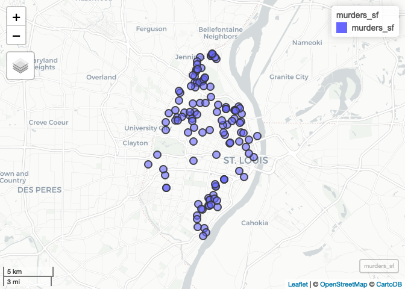
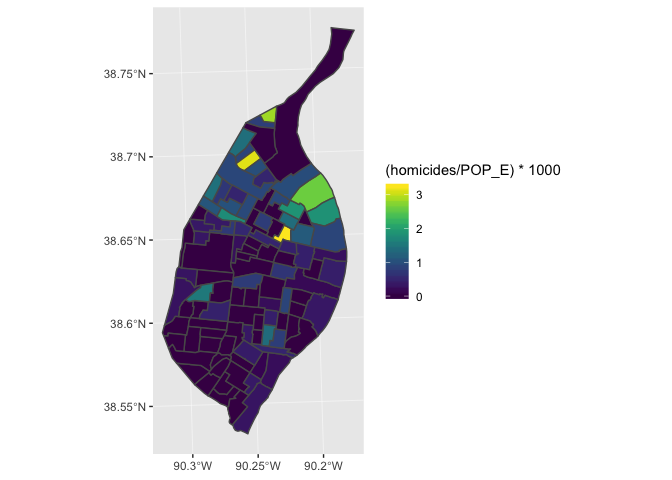
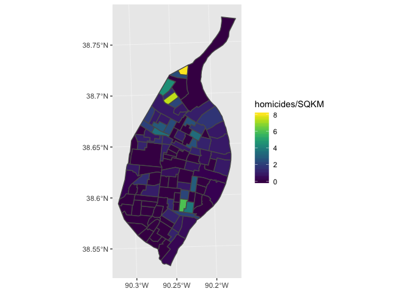

Lecture-11 Examples - Completed
================
Christopher Prener, Ph.D.
(March 25, 2019)

## Introduction

This notebook reviews projections from last week and introduces skills
for selecting by area and spatial joins in `R`.

## Dependencies

This notebook requires a number of different packages:

``` r
# tidyverse packages
library(dplyr)
```

    ## 
    ## Attaching package: 'dplyr'

    ## The following objects are masked from 'package:stats':
    ## 
    ##     filter, lag

    ## The following objects are masked from 'package:base':
    ## 
    ##     intersect, setdiff, setequal, union

``` r
library(ggplot2)
library(readr)

# spatial packages
library(mapview)
library(sf)
```

    ## Linking to GEOS 3.6.1, GDAL 2.1.3, PROJ 4.9.3

``` r
# other packages
library(here)
```

    ## here() starts at /Users/chris/GitHub/SOC5650/LectureRepos/lecture-11

``` r
library(viridis)
```

    ## Loading required package: viridisLite

## Load Data

This notebook requires a number of data sets:

``` r
# spatial data - census tracts with total area and population
pop <- st_read(here("data", "example-data", "STL_DEMOS_Pop", "STL_DEMOS_Pop.shp"),
               stringsAsFactors = FALSE)
```

    ## Reading layer `STL_DEMOS_Pop' from data source `/Users/chris/GitHub/SOC5650/LectureRepos/lecture-11/data/example-data/STL_DEMOS_Pop/STL_DEMOS_Pop.shp' using driver `ESRI Shapefile'
    ## Simple feature collection with 106 features and 5 fields
    ## geometry type:  POLYGON
    ## dimension:      XY
    ## bbox:           xmin: -90.32052 ymin: 38.53185 xmax: -90.16657 ymax: 38.77443
    ## epsg (SRID):    4269
    ## proj4string:    +proj=longlat +datum=NAD83 +no_defs

``` r
# spatial data - north city 
northCity <- st_read(here("data", "example-data", "STL_REGIONS_NorthCity", "STL_REGIONS_NorthCity.shp"),
               stringsAsFactors = FALSE)
```

    ## Reading layer `STL_REGIONS_NorthCity' from data source `/Users/chris/GitHub/SOC5650/LectureRepos/lecture-11/data/example-data/STL_REGIONS_NorthCity/STL_REGIONS_NorthCity.shp' using driver `ESRI Shapefile'
    ## Simple feature collection with 1 feature and 1 field
    ## geometry type:  POLYGON
    ## dimension:      XY
    ## bbox:           xmin: 734788.8 ymin: 4279831 xmax: 745417.9 ymax: 4295501
    ## epsg (SRID):    26915
    ## proj4string:    +proj=utm +zone=15 +ellps=GRS80 +towgs84=0,0,0,0,0,0,0 +units=m +no_defs

``` r
# tabular data - 2012 murders in St. Louis
murders <- read_csv(here("data", "example-data", "STL_MURDERS_2012.csv"))
```

    ## Parsed with column specification:
    ## cols(
    ##   date = col_character(),
    ##   address = col_character(),
    ##   x = col_double(),
    ##   y = col_double()
    ## )

## Project the Homicide Data

The homicide data are tabular, and have two columns named `x` and `y`.
Our first goal is to determine what projection they’re encoded with. We
can get a preview of their values with
    `str()`:

``` r
str(murders)
```

    ## Classes 'spec_tbl_df', 'tbl_df', 'tbl' and 'data.frame': 119 obs. of  4 variables:
    ##  $ date   : chr  "01/01/2012 00:50" "01/02/2012 01:30" "01/07/2012 10:00" "01/08/2012 16:53" ...
    ##  $ address: chr  "4931 PLOVER AVE" "4672 S SPRING AVE" "3311 MINNESOTA AVE" "8921 ANNETTA ST" ...
    ##  $ x      : num  889874 890691 896049 895051 895051 ...
    ##  $ y      : num  1042351 999312 1005918 1051024 1051024 ...
    ##  - attr(*, "spec")=
    ##   .. cols(
    ##   ..   date = col_character(),
    ##   ..   address = col_character(),
    ##   ..   x = col_double(),
    ##   ..   y = col_double()
    ##   .. )

What possibilities exist for coordinate systems?

``` r
# solution - state plane east, feet
murders_sf <- st_as_sf(murders, coords = c("x", "y"), crs = 102696)

# verify solution
mapview(murders_sf)
```

<!-- -->

## Convert All to Same Projection

Currently, our data are in three different projection systems:

``` r
# murders
st_crs(murders_sf)
```

    ## Coordinate Reference System:
    ##   EPSG: 102696 
    ##   proj4string: "+proj=tmerc +lat_0=35.83333333333334 +lon_0=-90.5 +k=0.9999333333333333 +x_0=250000 +y_0=0 +datum=NAD83 +units=us-ft +no_defs"

``` r
# tracts 
st_crs(pop)
```

    ## Coordinate Reference System:
    ##   EPSG: 4269 
    ##   proj4string: "+proj=longlat +datum=NAD83 +no_defs"

``` r
# north city
st_crs(northCity)
```

    ## Coordinate Reference System:
    ##   EPSG: 26915 
    ##   proj4string: "+proj=utm +zone=15 +ellps=GRS80 +towgs84=0,0,0,0,0,0,0 +units=m +no_defs"

In order to geoprocess and map our data, we want to convert them all to
the same coordinate system:

``` r
# murders
murders_sf <- st_transform(murders_sf, crs = 26915)

# tracts
pop <- st_transform(pop, crs = 26915)
```

We’re now ready to move on to our geoprocessing operations.

## Identify Points

Our first goal is to identify points - we want to label each homicide
with the tract identification number for the tract the homicide occured
in. We’ll use `st_intersection()` for this.

``` r
murders_tract <- st_intersection(murders_sf, pop) %>%
  select(date, address, GEOID)
```

    ## Warning: attribute variables are assumed to be spatially constant
    ## throughout all geometries

We can now preview these data and see the change:

``` r
mapview(murders_tract)
```

<!-- -->

## Aggregate Points

With identifiers applied to our data, we can aggregate them if we also
want counts of homicides by tract.

``` r
# aggregate
murders_tract %>%
  group_by(GEOID) %>%
  summarise(homicides = n()) -> murdersByTract

# remove geometry
st_geometry(murdersByTract) <- NULL

# join data and replace na's
murderPop <- left_join(pop, murdersByTract, by = "GEOID") %>%
  mutate(homicides = ifelse(is.na(homicides) == TRUE, 0, homicides))
```

### Plot Data

We can now plot homicides by population density:

``` r
ggplot() +
  geom_sf(data = murderPop, mapping = aes(fill = (homicides/POP_E)*1000)) +
  scale_fill_viridis()
```

<!-- -->

We can also plot by area density:

``` r
ggplot() +
  geom_sf(data = murderPop, mapping = aes(fill = homicides/SQKM)) +
  scale_fill_viridis()
```

<!-- -->

## Selecting by Area

If we want a data set of only homicides for a ceratin area, like north
city, *and* we have the geometric data for that region, we can subset
our data by that geometric area.

``` r
murders_nc <- st_intersection(murders_sf, northCity) %>%
  filter(region == "North City")
```

    ## Warning: attribute variables are assumed to be spatially constant
    ## throughout all geometries
